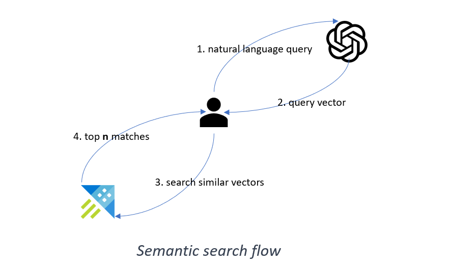

# Kusto as a Vector database

## Getting started with Kusto and Open AI embedding

### Demo Scenario

If you’d like to try this demo, please follow the instructions in the [Notebook](Getting_started_with_kusto_and_openai_embeddings.ipynb).

It will allow you to -  

1. Use precomputed embeddings created by OpenAI API. 

2. Store the embeddings in Kusto. 

3. Convert raw text query to an embedding with OpenAI API. 

4. Use Kusto to perform cosine similarity search in the stored embeddings.